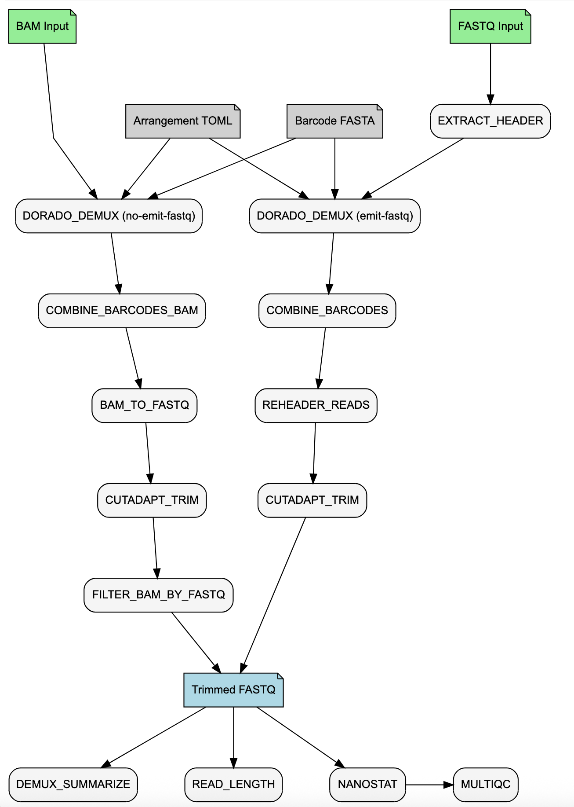

---
output:
  html_document: default
  word_document: default
---
# seqWell-ONT-dorado-demux


[](https://github.com/seqwell/seqWell-ONT-dorado-demux/actions/workflows/nextflow-ci.yml?query=branch%3Amain)
[](https://www.nextflow.io/)


This Nextflow pipeline demultiplexes 384-well Oxford Nanopore Technologies (ONT) data generated with the seqWell kit using Dorado. It accepts either **BAM** or **FASTQ** input and follows a branching processing strategy depending on input type, producing cleaned **FASTQ** output files (and filtered **BAM** output for BAM input) with QC reports.

## Pipeline Overview

The pipeline splits into two branches after the input type is determined:

```
                        ┌─────────────────────────────────────────────┐
                        │              BAM INPUT BRANCH               │
                        │                                             │
  *.bam files ─────────→ DORADO_DEMUX (--no-emit-fastq)               │
                        │        ↓                                    │
                        │ COMBINE_BARCODES_BAM                        │
                        │        ↓                                    │
                        │  BAM_TO_FASTQ  (samtools)                   │
                        │        ↓                                    │
                        │  CUTADAPT_TRIM                              │
                        │        ↓                                    │
                        │  FILTER_BAM_BY_FASTQ  (samtools)            │
                        │  (subset demux BAM by trimmed FASTQ IDs)    │
                        │        ↓                                    │
                        │  FASTQ + filtered BAM outputs               │
                        └─────────────────────────────────────────────┘

                        ┌─────────────────────────────────────────────┐
                        │             FASTQ INPUT BRANCH              │
                        │                                             │
  *.fastq.gz files ────→ EXTRACT_HEADER  (awk → uuid_tags.tsv)        │
                        │        ↓                                    │
                        │  DORADO_DEMUX (--emit-fastq)                │
                        │        ↓                                    │
                        │  COMBINE_BARCODES                           │
                        │        ↓                                    │
                        │  REHEADER_READS (restore original ONT tags) │
                        │        ↓                                    │
                        │  CUTADAPT_TRIM                              │
                        │        ↓                                    │
                        │  FASTQ outputs only (no BAM created)        │
                        └─────────────────────────────────────────────┘

                        ┌─────────────────────────────────────────────┐
                        │        SHARED DOWNSTREAM QC (both branches) │
                        │                                             │
                        │  DEMUX_SUMMARIZE → READ_LENGTH → NANOSTAT   │
                        │                                    ↓        │
                        │                                 MULTIQC     │
                        └─────────────────────────────────────────────┘
```

### BAM Input Steps

1. **DORADO_DEMUX** (BAM mode): Demultiplexes input BAMs using Dorado with custom 384 seqWell barcode sequences. Emits per-sample BAM directories (no FASTQ).

2. **COMBINE_BARCODES_BAM**: Merges per-barcode BAM files from multiple demux directories into one BAM per barcode.

3. **BAM_TO_FASTQ**: Converts each per-barcode demuxed BAM to FASTQ using samtools. This FASTQ is used as input to Cutadapt. No header extraction step is needed for BAM input.

4. **CUTADAPT_TRIM**: Two-step adapter trimming on the converted FASTQ:
   - Step 1: Trims ME (Mosaic End) adapters from the 5′ end and filters by minimum read length.
   - Step 2: Detects any remaining ME sequence anywhere in the read; reads with ME are written to `.ME.tagged.fastq.gz` (removed from final output), clean reads to `.seqWell.fastq.gz`.

5. **FILTER_BAM_BY_FASTQ**: Subsets the demux BAM to retain only reads whose names appear in the trimmed FASTQ. This propagates cutadapt adapter/length/ME-tag filtering back onto the BAM. Keys are matched on bare barcode ID (e.g. `barcode001`).

### FASTQ Input Steps

1. **EXTRACT_HEADER**: Extracts FASTQ header fields (`runid`, `ch`, `start_time`, `basecall_model_version_id`, etc.) using awk **before** demultiplexing. Writes a UUID-keyed TSV lookup used by REHEADER_READS to restore original headers after demux.

2. **DORADO_DEMUX** (FASTQ mode): Demultiplexes input FASTQs using Dorado with custom 384 seqWell barcode sequences. Emits per-sample FASTQ directories (`--emit-fastq`).

3. **COMBINE_BARCODES**: Merges per-barcode FASTQ files from multiple demux directories into one FASTQ per barcode.

4. **REHEADER_READS**: Restores original ONT read header metadata to each per-barcode FASTQ by joining on read UUID against the TSV from EXTRACT_HEADER.

5. **CUTADAPT_TRIM**: Two-step adapter trimming on the reheadered FASTQ (same logic as BAM branch). No BAM files are created for FASTQ input.

### Shared Downstream QC (Both Branches)

6. **DEMUX_SUMMARIZE**: Generates a per-barcode read count summary CSV from the trimmed FASTQs. Only barcodes matching `barcode*` or `unknown` are passed forward.

7. **READ_LENGTH**: Calculates and plots read length distributions per barcode.

8. **NANOSTAT**: Produces detailed per-sample sequencing statistics.

9. **MULTIQC**: Aggregates NanoStat results into a single interactive HTML report.





## Dependencies

- **Nextflow** ≥ 22.04.5
- **Docker**

### Docker Containers

| Process | Container |
|---|---|
| DORADO_DEMUX | `genomicpariscentre/dorado:1.1.1` |
| COMBINE_BARCODES | `ubuntu:20.04` |
| COMBINE_BARCODES_BAM | `ubuntu:20.04` |
| EXTRACT_HEADER | `quay.io/biocontainers/pysam:0.22.0--py39hcada746_0` |
| REHEADER_READS | `seqwell/python:v2.0` |
| CUTADAPT_TRIM | `quay.io/biocontainers/cutadapt:5.0--py310h1fe012e_0` |
| BAM_TO_FASTQ | `quay.io/biocontainers/samtools:1.21--h50ea8bc_0` |
| FILTER_BAM_BY_FASTQ | `quay.io/biocontainers/samtools:1.21--h50ea8bc_0` |
| DEMUX_SUMMARIZE | `ubuntu:20.04` |
| READ_LENGTH | `seqwell/python:v2.0` |
| NANOSTAT | `quay.io/biocontainers/nanostat:1.6.0--pyhdfd78af_0` |
| MULTIQC | `quay.io/biocontainers/multiqc:1.25.1--pyhdfd78af_0` |

## How to Run the Pipeline

### Required Parameters

#### `--input`
Path to a directory containing input files. Must contain either `*.bam` or `*.fastq.gz` files matching the specified `--data_type`. Supports local paths and AWS S3 URIs.

#### `--data_type`
Specifies the input file format. Must be either `bam` or `fastq`.

```bash
--data_type bam      # input directory contains *.bam files
--data_type fastq    # input directory contains *.fastq.gz files
```

BAM input produces both **FASTQ and filtered BAM** outputs. FASTQ input produces **FASTQ outputs only** — no BAM files are created.

#### `--outdir`
Output directory path. Supports local paths and AWS S3 URIs.

#### `--pool_ID`
A unique identifier for the sequencing run. Used in the demux summary report filename.

#### `--barcodes`
Path to the barcode FASTA file. Defaults to `assets/barcodes.384.fa`.

#### `--arrangement_toml`
Path to the barcode arrangement TOML for Dorado. Defaults to `assets/arrangement.toml`.

#### `--length_filter`
Minimum read length to retain after trimming. Default: `150`.

#### `--error_rate`
Error rate threshold used to filter out reads with ME in **CUTADAPT_TRIM**. Default: `0.12`.

### Profiles

| Profile | Description |
|---|---|
| `standard` | Default. Runs locally with Docker. |
| `docker` | Explicit local Docker run. |
| `test` | Runs with built-in test data (`data_type=bam`). |
| `awsbatch` | Runs on AWS Batch. |

### Example Commands

**BAM input:**
```bash
nextflow run main.nf \
    --data_type bam \
    --input /path/to/bam/directory \
    --outdir /path/to/output \
    --pool_ID my_run \
    -resume -bg
```

**FASTQ input:**
```bash
nextflow run main.nf \
    --data_type fastq \
    --input /path/to/fastq/directory \
    --outdir /path/to/output \
    --pool_ID my_run \
    -resume -bg
```

**AWS Batch:**
```bash
nextflow run main.nf \
    -profile awsbatch \
    --data_type bam \
    --input s3://bucket/bam/ \
    --outdir s3://bucket/output/ \
    --pool_ID my_run \
    -resume -bg
```


### test run Commands

**BAM input:**
```bash
nextflow run main.nf \
    --data_type bam \
    --input "${PWD}/test_data/bam_pass/" \
    --outdir "${PWD}/bam_test_output" \
    --pool_ID test_bam \
    -resume -bg
```

**FASTQ input:**
```bash
nextflow run main.nf \
    --data_type fastq \
    --input "${PWD}/test_data/fastq_pass/" \
    --outdir "${PWD}/fastq_test_output" \
    --pool_ID test_fastq \
    -resume -bg
```


## Expected Outputs

```
output_directory/
├── demuxed_fastq/                          # Per-barcode subdirectories
│   ├── barcode001/
│   │   └── barcode001.seqWell.fastq.gz
│   ├── barcode002/
│   │   └── barcode002.seqWell.fastq.gz
│   └── ...
├── demuxed_fastq_flat/                     # Same files in flat structure
│   ├── barcode001.seqWell.fastq.gz
│   ├── barcode002.seqWell.fastq.gz
│   └── ...
├── demuxed_bam/                            # BAM output (BAM input mode only)
│   ├── barcode001/
│   │   └── barcode001.seqWell.bam          # Demux BAM filtered by trimmed FASTQ read IDs
│   ├── barcode002/
│   │   └── barcode002.seqWell.bam
│   └── ...
├── demuxed_bam_flat/                       # Same BAMs in flat structure (BAM input mode only)
│   ├── barcode001.seqWell.bam
│   ├── barcode002.seqWell.bam
│   └── ...
├── demux_summary/
│   └── <pool_ID>_demux_report.csv          # Per-barcode read counts + percentages
├── read_length/
│   ├── barcode001.seqWell.read_length_plot.png
│   ├── barcode001.seqWell.read_length_plot_weighted.png
│   └── ...
├── multiqc/
│   └── multiqc_report.html                 # Aggregated MultiQC report
└── other/
    └── ME_tagged_fastq/
        ├── barcode001.ME.tagged.fastq.gz   # Reads with residual ME adapter (excluded)
        └── ...
```

## Notes on BAM vs FASTQ Mode

- **BAM input** demuxes directly as BAM, converts to FASTQ for Cutadapt trimming, then filters the original demux BAM by the read IDs that survive trimming. This keeps the final BAM consistent with the FASTQ output — reads removed by Cutadapt (too short, ME-tagged) are also removed from the BAM.
- **FASTQ input** extracts read headers *before* demuxing so that original ONT metadata tags can be restored after Dorado reassigns them during demux. No BAM files are produced in this mode.
- The FASTQ-internal processing approach (converting BAM→FASTQ before Cutadapt) avoids reliance on Cutadapt's unreliable BAM support for unaligned ONT reads.
- Barcode ID matching throughout the pipeline is keyed on the bare barcode label (e.g. `barcode001`), stripped of any filename suffixes, to ensure consistent joins between modules.
