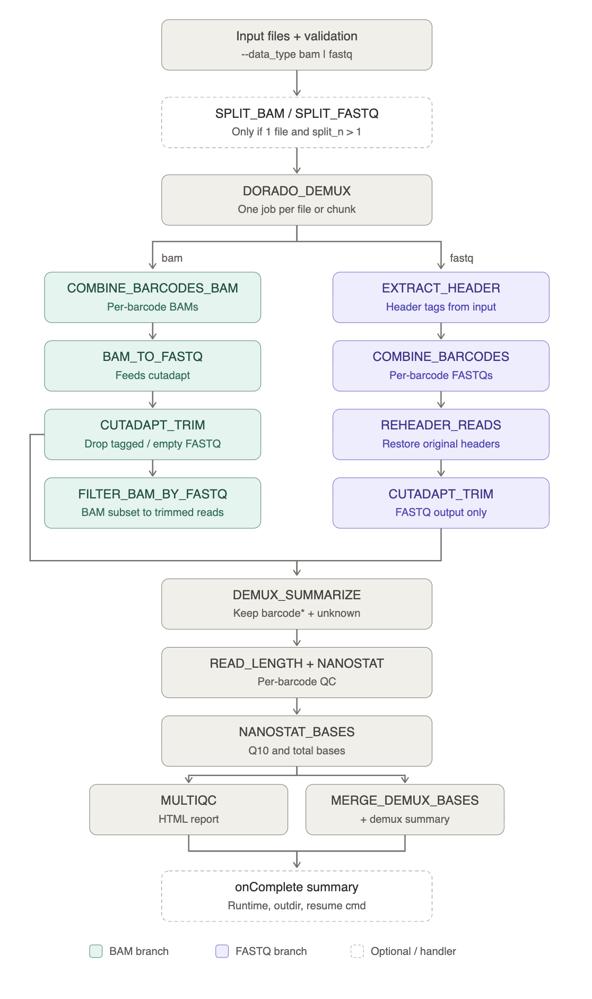

---
output:
  html_document: default
  word_document: default
---
# seqWell-ONT-dorado-demux


[](https://github.com/seqwell/seqWell-ONT-dorado-demux/actions/workflows/nextflow-ci.yml?query=branch%3Amain)
[](https://www.nextflow.io/)


This Nextflow pipeline demultiplexes 384-well Oxford Nanopore Technologies (ONT) data generated with the seqWell kit using Dorado. It accepts either **BAM** or **FASTQ** input (gzipped or uncompressed) and follows a branching processing strategy depending on input type, producing cleaned **FASTQ** output files (and filtered **BAM** output for BAM input) with QC reports.

When the input directory contains a **single file**, the pipeline can optionally split it into chunks and run Dorado on each chunk in parallel (see [`--split_n`](#--split_n)).

## Pipeline Overview

The pipeline splits into two branches after the input type is determined. In both branches, an optional split step runs first when there is only one input file:

```
                        ┌─────────────────────────────────────────────┐
                        │              BAM INPUT BRANCH               │
                        │                                             │
  *.bam files ─────────→ [SPLIT_BAM]  (only if 1 file & split_n > 1) │
                        │        ↓                                    │
                        │ DORADO_DEMUX (--no-emit-fastq)              │
                        │        ↓                                    │
                        │ COMBINE_BARCODES_BAM                        │
                        │        ↓                                    │
                        │  BAM_TO_FASTQ  (samtools)                   │
                        │        ↓                                    │
                        │  CUTADAPT_TRIM                              │
                        │        ↓                                    │
                        │  FILTER_BAM_BY_FASTQ  (samtools)            │
                        │  (subset demux BAM by trimmed FASTQ IDs)    │
                        │        ↓                                    │
                        │  FASTQ + filtered BAM outputs               │
                        └─────────────────────────────────────────────┘

                        ┌─────────────────────────────────────────────┐
                        │             FASTQ INPUT BRANCH              │
                        │                                             │
  *.fastq(.gz) files ──→ [SPLIT_FASTQ] (only if 1 file & split_n > 1)│
                        │        ↓                                    │
                        │  EXTRACT_HEADER  (python → uuid_tags.tsv)   │
                        │        ↓                                    │
                        │  DORADO_DEMUX (--emit-fastq)                │
                        │        ↓                                    │
                        │  COMBINE_BARCODES                           │
                        │        ↓                                    │
                        │  REHEADER_READS (ONT metadata → SAM tags)   │
                        │        ↓                                    │
                        │  CUTADAPT_TRIM                              │
                        │        ↓                                    │
                        │  FASTQ outputs only (no BAM created)        │
                        └─────────────────────────────────────────────┘

                        ┌─────────────────────────────────────────────┐
                        │        SHARED DOWNSTREAM QC (both branches) │
                        │                                             │
                        │  DEMUX_SUMMARIZE → READ_LENGTH → NANOSTAT   │
                        │                                    ↓        │
                        │                                 MULTIQC     │
                        └─────────────────────────────────────────────┘
```

### Optional Split Step (both branches)

0. **SPLIT_FASTQ / SPLIT_BAM**: Runs only when the input directory contains exactly **one** file and `--split_n` is greater than 1. The file is split into `split_n` roughly equal chunks, and each chunk becomes its own `DORADO_DEMUX` job, so demultiplexing runs in parallel. The chunks are named `<sample>.part_NNN`.
   - **SPLIT_FASTQ** uses `seqkit split2` and always writes gzipped chunks, whether the input was `.fastq` or `.fastq.gz`.
   - **SPLIT_BAM** uses `samtools` + `awk` to distribute records round-robin across chunks. Every chunk keeps the full BAM header, and aux tags (e.g. MM/ML, RG) are preserved.

     With multiple input files, or with `--split_n 1`, no splitting is done.

### BAM Input Steps

1. **DORADO_DEMUX** (BAM mode): Demultiplexes input BAMs (or BAM chunks) using Dorado with custom 384 seqWell barcode sequences. Emits per-sample BAM directories (no FASTQ). Dorado threads are set to the task's CPU allocation (`--threads ${task.cpus}`), which is sized from the input file (see [`--large_input_gb`](#--large_input_gb)).

2. **COMBINE_BARCODES_BAM**: Merges per-barcode BAM files from multiple demux directories into one BAM per barcode.

3. **BAM_TO_FASTQ**: Converts each per-barcode demuxed BAM to FASTQ using samtools. This FASTQ is used as input to Cutadapt. No header extraction step is needed for BAM input.

4. **CUTADAPT_TRIM**: Two-step adapter trimming on the converted FASTQ:
   - Step 1: Trims ME (Mosaic End) adapters from the 5′ end and filters by minimum read length.
   - Step 2: Detects any remaining ME sequence anywhere in the read; reads with ME are written to `.ME.tagged.fastq.gz` (removed from final output), clean reads to `.seqWell.fastq.gz`.

5. **FILTER_BAM_BY_FASTQ**: Subsets the demux BAM to retain only reads whose names appear in the trimmed FASTQ. This propagates cutadapt adapter/length/ME-tag filtering back onto the BAM. Keys are matched on bare barcode ID (e.g. `barcode001`).

### FASTQ Input Steps

1. **EXTRACT_HEADER**: Runs `extract_fastq_tags.py` **before** demultiplexing, per input file or per chunk. It parses the Dorado FASTQ header `key=value` fields and converts them to SAM-format tags: `ch`→`ch:i`, `read`→`rn:i`, `start_time`→`st:Z`, `flow_cell_id`→`fn:Z`, `runid`→`RG:Z`, `barcode`→`BC:Z`, `barcode_score`→`bs:i`, `protocol_group_id`→`px:Z`, `sample_id`→`si:Z`, `parent_read_id`→`pi:Z`, and `basecall_model_version_id`→`bv:Z`. Fields not in this map are dropped. Accepts gzipped or uncompressed FASTQ (detected from file contents, not the extension). Writes a UUID-keyed TSV (`<sample>.uuid_tags.tsv`) that REHEADER_READS uses to restore this metadata as SAM-format tags after Dorado demux strips it.

2. **DORADO_DEMUX** (FASTQ mode): Demultiplexes input FASTQs (or FASTQ chunks) using Dorado with custom 384 seqWell barcode sequences. Dorado reads gzipped or uncompressed FASTQ directly. Emits per-sample FASTQ directories (`--emit-fastq`, uncompressed). Dorado threads are set to the task's CPU allocation (`--threads ${task.cpus}`), which is sized from the input file (see [`--large_input_gb`](#--large_input_gb)).

3. **COMBINE_BARCODES**: Merges per-barcode FASTQ files from multiple demux directories into one gzipped FASTQ per barcode.

4. **REHEADER_READS**: Restores ONT header metadata as SAM-format tags in each per-barcode FASTQ, by joining on read UUID against the TSVs from EXTRACT_HEADER. Output headers look like `@<uuid> ch:i:123 rn:i:456 st:Z:... RG:Z:...`. The original `key=value` fields are not reproduced verbatim, and fields not mapped by EXTRACT_HEADER are dropped. Only the tags for reads in that barcode are loaded, so memory scales with the barcode's read count rather than with the whole run.

5. **CUTADAPT_TRIM**: Two-step adapter trimming on the reheadered FASTQ (same logic as BAM branch). No BAM files are created for FASTQ input.

### Shared Downstream QC (Both Branches)

6. **DEMUX_SUMMARIZE**: Generates a per-barcode read count summary CSV from the trimmed FASTQs. Only barcodes matching `barcode*` or `unknown` are passed forward.

7. **READ_LENGTH**: Calculates and plots read length distributions per barcode.

8. **NANOSTAT**: Produces detailed per-sample sequencing statistics.

9. **MULTIQC**: Aggregates NanoStat results into a single interactive HTML report.





## Dependencies

- **Nextflow** >22.04.5
- **Docker**

### Docker Containers

| Process | Container |
|---|---|
| SPLIT_FASTQ | `quay.io/biocontainers/seqkit:2.13.0--he881be0_0` |
| SPLIT_BAM | `quay.io/biocontainers/samtools:1.21--h50ea8bc_0` |
| DORADO_DEMUX | `seqwell/dorado:1.1.1` |
| COMBINE_BARCODES | `quay.io/biocontainers/samtools:1.21--h50ea8bc_0` |
| COMBINE_BARCODES_BAM | `quay.io/biocontainers/samtools:1.21--h50ea8bc_0` |
| EXTRACT_HEADER | `quay.io/biocontainers/pysam:0.22.0--py39hcada746_0` |
| REHEADER_READS | `seqwell/python:v2.0` |
| CUTADAPT_TRIM | `quay.io/biocontainers/cutadapt:5.0--py310h1fe012e_0` |
| BAM_TO_FASTQ | `quay.io/biocontainers/samtools:1.21--h50ea8bc_0` |
| FILTER_BAM_BY_FASTQ | `quay.io/biocontainers/samtools:1.21--h50ea8bc_0` |
| DEMUX_SUMMARIZE | `ubuntu:20.04` |
| READ_LENGTH | `seqwell/python:v2.0` |
| NANOSTAT | `quay.io/biocontainers/nanostat:1.6.0--pyhdfd78af_0` |
| MULTIQC | `quay.io/biocontainers/multiqc:1.25.1--pyhdfd78af_0` |

## How to Run the Pipeline

### Required Parameters

#### `--input`
Path to a directory containing input files matching the specified `--data_type`:

- `--data_type bam`: `*.bam`
- `--data_type fastq`: `*.fastq.gz`, `*.fq.gz`, `*.fastq` or `*.fq` (gzipped and uncompressed files are both accepted)

Supports local paths and AWS S3 URIs.

#### `--data_type`
Specifies the input file format. Must be either `bam` or `fastq`.

```bash
--data_type bam      # input directory contains *.bam files
--data_type fastq    # input directory contains *.fastq(.gz) / *.fq(.gz) files
```

BAM input produces both **FASTQ and filtered BAM** outputs. FASTQ input produces **FASTQ outputs only** — no BAM files are created.

#### `--outdir`
Output directory path. Supports local paths and AWS S3 URIs.

#### `--pool_ID`
A unique identifier for the sequencing run. Used in the demux summary report filename.

#### `--barcodes`
Path to the barcode FASTA file. Defaults to `assets/barcodes.384.fa`.

#### `--arrangement_toml`
Path to the barcode arrangement TOML for Dorado. Defaults to `assets/arrangement.toml`.

#### `--length_filter`
Minimum read length to retain after trimming. Default: `150`.

#### `--error_rate`
Error rate threshold used to filter out reads with ME in **CUTADAPT_TRIM**. Default: `0.12`.

### Optional Parameters

#### `--split_n`
Number of chunks to split the input into when the input directory contains a **single** file. Each chunk is demultiplexed by its own Dorado job in parallel. Default: `15`.

- `--split_n 1` disables splitting. The single file is demultiplexed as one Dorado job.
- Ignored when the input directory contains more than one file. Each file is already its own Dorado job.

Splitting usually shortens wall-clock time on AWS Batch, where many small jobs run concurrently. On a single machine, the gain depends on the number of available cores.

#### `--large_input_gb`
Size threshold, in GB, that sets the resources for each `DORADO_DEMUX` task. Default: `1`.

| File received by the DORADO_DEMUX task | Resources |
|---|---|
| ≤ `large_input_gb` | 2 CPU / 7 GB |
| > `large_input_gb` | 4 CPU / 15 GB |

The size is checked per task, on the file that task demultiplexes: a split chunk, one of several input files, or a whole unsplit file. In practice:

- **Split chunks and normal `fastq_pass/` files** are usually small and get 2 CPU / 7 GB.
- **A single large file run with `--split_n 1`** gets 4 CPU / 15 GB automatically, so Dorado isn't stuck on 2 threads.
- **Very large inputs split into few chunks** can produce chunks above the threshold, which then also get 4 CPU / 15 GB. Raise `--split_n` to keep chunks small if you prefer more, smaller jobs.

Decimal values are accepted (e.g. `--large_input_gb 0.5`).

> **Note:** with local execution, a "large" task needs at least 4 CPUs and 15 GB available on the machine (and in Docker Desktop's resource settings on macOS). On AWS Batch, the compute environment must offer an instance type with at least 4 vCPUs, otherwise large tasks stay queued.

### Profiles

| Profile | Description |
|---|---|
| `standard` | Default. Runs locally with Docker. |
| `docker` | Explicit local Docker run. |
| `test` | Runs with built-in test data (`data_type=bam`). |
| `awsbatch` | Runs on AWS Batch. |

### Example Commands

**BAM input:**
```bash
nextflow run main.nf \
    --data_type bam \
    --input /path/to/bam/directory \
    --outdir /path/to/output \
    --pool_ID my_run \
    -resume -bg
```

**FASTQ input:**
```bash
nextflow run main.nf \
    --data_type fastq \
    --input /path/to/fastq/directory \
    --outdir /path/to/output \
    --pool_ID my_run \
    -resume -bg
```

**Single large FASTQ, split into 20 chunks:**
```bash
nextflow run main.nf \
    --data_type fastq \
    --input /path/to/single_fastq_directory \
    --outdir /path/to/output \
    --pool_ID my_run \
    --split_n 20 \
    -resume -bg
```

**Single large FASTQ, no split** (Dorado gets 4 CPU / 15 GB automatically if the file is larger than `--large_input_gb`):
```bash
nextflow run main.nf \
    --data_type fastq \
    --input /path/to/single_fastq_directory \
    --outdir /path/to/output \
    --pool_ID my_run \
    --split_n 1 \
    -resume -bg
```

**AWS Batch:**
```bash
nextflow run main.nf \
    -profile awsbatch \
    --data_type bam \
    --input s3://bucket/bam/ \
    --outdir s3://bucket/output/ \
    --pool_ID my_run \
    -resume -bg
```


### test run Commands

**BAM input:**
```bash
nextflow run main.nf \
    --data_type bam \
    --input "${PWD}/test_data/bam_pass/" \
    --outdir "${PWD}/bam_test_output" \
    --pool_ID test_bam \
    -resume -bg
```

**FASTQ input:**
```bash
nextflow run main.nf \
    --data_type fastq \
    --input "${PWD}/test_data/fastq_pass/" \
    --outdir "${PWD}/fastq_test_output" \
    --pool_ID test_fastq \
    -resume -bg
```


**single FASTQ input ( `--split_n`: 2):**
```bash
nextflow run main.nf \
    --data_type fastq \
    --input "${PWD}/test_data/large_merged_fastq/" \
    --outdir "${PWD}/10g_merged_fastq_test_output" \
    --pool_ID test_fastq \
    --split_n 2 \
    -resume -bg
```

**single FASTQ input (no split):**
```bash
nextflow run main.nf \
    --data_type fastq \
    --input "${PWD}/test_data/large_merged_fastq/" \
    --outdir "${PWD}/10g_merged_fastq_nosplit_test_output" \
    --pool_ID test_fastq \
    --split_n 1 \
    -resume -bg
```


## Expected Outputs

The output structure is the same whether or not the input was split.

```
output_directory/
├── demuxed_fastq/                          # Per-barcode subdirectories
│   ├── barcode001/
│   │   └── barcode001.seqWell.fastq.gz
│   ├── barcode002/
│   │   └── barcode002.seqWell.fastq.gz
│   └── ...
├── demuxed_fastq_flat/                     # Same files in flat structure
│   ├── barcode001.seqWell.fastq.gz
│   ├── barcode002.seqWell.fastq.gz
│   └── ...
├── demuxed_bam/                            # BAM output (BAM input mode only)
│   ├── barcode001/
│   │   └── barcode001.seqWell.bam          # Demux BAM filtered by trimmed FASTQ read IDs
│   ├── barcode002/
│   │   └── barcode002.seqWell.bam
│   └── ...
├── demuxed_bam_flat/                       # Same BAMs in flat structure (BAM input mode only)
│   ├── barcode001.seqWell.bam
│   ├── barcode002.seqWell.bam
│   └── ...
├── demux_summary/
│   └── <pool_ID>_demux_report.csv          # Per-barcode read counts + percentages
├── read_length/
│   ├── barcode001.seqWell.read_length_plot.png
│   ├── barcode001.seqWell.read_length_plot_weighted.png
│   └── ...
├── multiqc/
│   └── multiqc_report.html                 # Aggregated MultiQC report
└── other/
    └── ME_tagged_fastq/
        ├── barcode001.ME.tagged.fastq.gz   # Reads with residual ME adapter (excluded)
        └── ...
```

## Notes on BAM vs FASTQ Mode

- **BAM input** demuxes directly as BAM, converts to FASTQ for Cutadapt trimming, then filters the original demux BAM by the read IDs that survive trimming. This keeps the final BAM consistent with the FASTQ output — reads removed by Cutadapt (too short, ME-tagged) are also removed from the BAM.
- **FASTQ input** extracts read headers *before* demuxing so that ONT header metadata can be restored as SAM-format tags after Dorado strips it during demux. No BAM files are produced in this mode.
- The FASTQ-internal processing approach (converting BAM→FASTQ before Cutadapt) avoids reliance on Cutadapt's unreliable BAM support for unaligned ONT reads.
- Barcode ID matching throughout the pipeline is keyed on the bare barcode label (e.g. `barcode001`), stripped of any filename suffixes, to ensure consistent joins between modules.

## Notes on Splitting

- Splitting only applies to a **single** input file. Multi-file inputs (e.g. a standard `fastq_pass/` directory) are already demultiplexed in parallel, one Dorado job per file.
- Chunks are intermediate files in the Nextflow work directory and are not published.
- `DORADO_DEMUX` resources are chosen per task from the size of the file it receives (see [`--large_input_gb`](#--large_input_gb)), so split and unsplit runs are both sized sensibly without editing the config.
- Read order within each barcode may differ from the input order when splitting. This does not affect demultiplexing or downstream results.
- Dorado writes uncompressed FASTQ, so the work directory can be several times larger than the input during a run. Use `cleanup = true` in `nextflow.config` to remove the work directory after a successful run (this disables `-resume` for that run).
