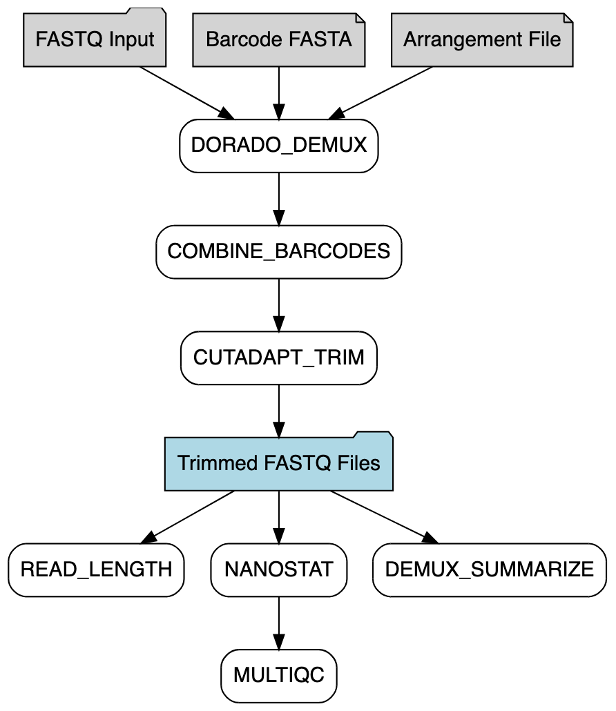

# seqWell-ONT-dorado-demux


[](https://github.com/seqwell/seqWell-ONT-dorado-demux/actions/workflows/nextflow-ci.yml?query=branch%3Amain)
[](https://www.nextflow.io/)


This Nextflow pipeline demultiplexes 384-well Oxford Nanopore Technologies (ONT) data generated with the seqWell kit using Dorado. It processes Dorado high-accuracy FASTQ files, assigns reads based on customer 384 seqWell barcodes, filters by read length, and produces comprehensive QC reports.

## Pipeline Overview

The pipeline processes ONT sequencing data through the following key steps:

1. **DORADO_DEMUX**: Performs initial demultiplexing using dorado with custom 384 seqWell barcode sequences and arrangement configuration
2. **COMBINE_BARCODES**: Merges demultiplexed FASTQ files from the same barcode across multiple dorado demuxed FASTQ files
3. **CUTADAPT_TRIM**: Performs read length filtering and adapter trimming (ME mosaic end, if any) with cutadapt
4. **DEMUX_SUMMARIZE**: Generates comprehensive summary statistics and reports from the demultiplexing results
5. **READ_LENGTH**: Calculates read length distributions from the demultiplexed FASTQ files
6. **NANOSTAT**: Produces detailed per-sample sequencing statistics from the demultiplexed FASTQ files
7. **MULTIQC**: Aggregates results from NanoStat into a single interactive HTML report





The final output includes demultiplexed FASTQ files for each barcode, detailed summary reports showing read counts by barcode, weighted read length distribution plots, and a MultiQC report aggregating all quality metrics.

## Dependencies

This pipeline requires installation of:
- **Nextflow**: Workflow management system
- **Docker**: Containerization platform for running pipeline processes

### Docker Containers

All docker containers used in this pipeline are publicly available:

- **DORADO_DEMUX**: `genomicpariscentre/dorado:1.1.1` 
- **COMBINE_BARCODES**: `ubuntu:20.04`
- **CUTADAPT_TRIM**: `quay.io/biocontainers/cutadapt:5.0--py310h1fe012e_0`
- **DEMUX_SUMMARIZE**: `ubuntu:20.04`
- **READ_LENGTH**: `seqwell/python:v2.0`
- **NANOSTAT**: `quay.io/biocontainers/nanostat:1.6.0--pyhdfd78af_0`
- **MULTIQC**: `quay.io/biocontainers/multiqc:1.25.1--pyhdfd78af_0`

## How to Run the Pipeline

### Required Parameters

The pipeline requires the following parameters:

#### `--input`
Path to a directory containing FASTQ files generated by Dorado high-accuracy basecalling for demultiplexing. The pipeline automatically detects all files ending with *.fastq.gz in this directory. This can be either a local absolute path or an AWS S3 URI. If using an S3 URI, ensure your AWS credentials are properly configured in the nextflow.config file.

#### `--outdir`
The output directory path where results will be saved. This can be a local absolute path or an AWS S3 URI. If using an AWS S3 URI, please ensure your security credentials are configured in the `nextflow.config` file.

#### `--barcodes`
Path to the barcode FASTA file used for Dorado demultiplexing. The default barcode file (**barcodes.384.fa**) is located in the `assets` folder.

#### `--arrangement_toml`
Path to the TOML configuration file defining the barcode arrangement for Dorado demultiplexing. The default arrangement file (**arrangement.toml**) is located in the assets directory.

### Profiles

Several profiles are available and can be selected with the `-profile` option at the command line. The default profile is `docker`.

- **docker**: Run pipeline using Docker containers (default)
- **awsbatch**: Run pipeline on AWS Batch

### Example Command

A minimal execution might look like:

```bash
nextflow run \
    main.nf \
    --input "${PWD}/path/to/fastq/directory" \
    --outdir "${PWD}/path/to/output" \
    -resume -bg
```

### Running Test Data

The pipeline can be run using test data with:

```bash
nextflow run \
    main.nf \
    --input "${PWD}/test_data/fastq_pass" \
    --outdir "${PWD}/test_output" \
    -resume -bg
```

## Expected Outputs

```
output_directory/
├── demuxed_fastq
│   ├── barcode001.seqWell.fastq.gz                         # Final demuxed reads after dorado and cutadapt
│   ├── barcode002.seqWell.fastq.gz
│   ├── barcode003.seqWell.fastq.gz
│   ├── ...
│   └── unclassified.seqWell.fastq.gz                       # Unassigned reads
├── demux_summary/
│   └── demux_report.csv                                    # Demux summary report
├── read_length/
│   ├── barcode001.seqWell.read_length_plot.png             
│   ├── barcode001.seqWell.read_length_plot_weighted.png.   # Weighted per-sample read length distribution
│   ├── barcode002.seqWell.read_length_plot.png             
│   ├── barcode002.seqWell.read_length_plot_weighted.png.   # Weighted per-sample read length distribution
│   └── ...
└── multiqc/
│   └── multiqc_report.html                                 # Aggregated MultiQC report
├── other
│   ├── ME_tagged_fastq
│       ├── barcode001.ME.tagged.fastq.gz                   # Demuxed reads still with Masaic end, removed
│       ├── barcode002.ME.tagged.fastq.gz
│       └── ...
```

